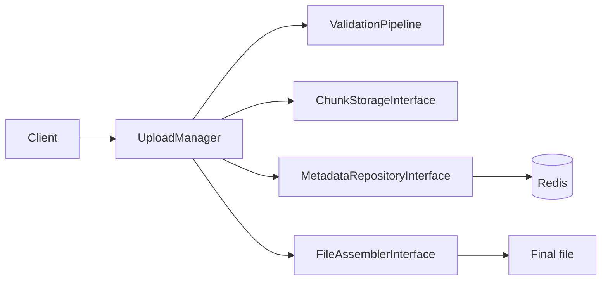

# Resumable Chunked Uploader

Framework-agnostic PHP 8.2 library for secure, resumable uploads. Chunks are persisted independently, progress is durable, and final assembly uses native PHP streams instead of buffering the complete file.

## Highlights

- Constant-memory chunk assembly with `fopen()` and stream copying.
- Resume support for out-of-order chunks and interrupted requests.
- Atomic Redis progress updates and configurable expiration.
- HMAC tokens bound to upload metadata and client context.
- Header-only magic-byte MIME validation and strict path sanitization.
- Optional ClamAV scanning and Redis rate limiting.
- No Laravel, Symfony, Redis, S3, or ClamAV dependency in the core package.

## Architecture



## Installation

```bash
composer require resumable/chunked-uploader
```

The package requires PHP 8.2 and `ext-json`. Redis can be provided by `ext-redis` or Predis, depending on the adapter used by your application.

## Standalone PHP

```php
<?php

declare(strict_types=1);

use Resumable\ChunkedUploader\Core\Assembler\StreamAssembler;
use Resumable\ChunkedUploader\Core\Drivers\Security\UploadTokenManager;
use Resumable\ChunkedUploader\Core\Drivers\Storage\LocalChunkStorage;
use Resumable\ChunkedUploader\Core\Models\Chunk;
use Resumable\ChunkedUploader\Core\UploadManager;

$storage = new LocalChunkStorage('/var/lib/my-app/upload-chunks');
$assembler = new StreamAssembler('/var/lib/my-app/files');
$manager = new UploadManager(
    storage: $storage,
    metadata: $redisTracker,
    progress: $redisTracker,
    assembler: $assembler,
    tokenManager: new UploadTokenManager($_ENV['UPLOAD_TOKEN_SECRET']),
);

$state = $manager->processChunk(new Chunk(
    identifier: 'upload_123',
    token: $token,
    index: 0,
    totalChunks: 4,
    chunkSize: filesize($temporaryUpload),
    totalSize: 20_000_000,
    tmpFilePath: $temporaryUpload,
    originalFilename: 'archive.zip',
));
```

Create one `Chunk` per HTTP request. The `index` is zero-based. Retrying an already accepted index is idempotent.

## Framework integrations

### Laravel 10 and 11

Register the provider from `src/Bridge/Laravel/ChunkUploaderServiceProvider.php`, publish or merge `src/Bridge/Laravel/config/chunk-uploader.php`, and bind the Redis tracker and storage paths in application configuration. The example controller is in [`examples/laravel/ChunkUploadController.php`](examples/laravel/ChunkUploadController.php).

Typical routes are:

```php
Route::post('/upload/token', [ChunkUploadController::class, 'issueToken']);
Route::post('/upload', [ChunkUploadController::class, 'store']);
Route::get('/upload/status/{identifier}', [ChunkUploadController::class, 'status']);
```

### Symfony 6 and 7

Register `src/Bridge/Symfony/ChunkUploaderBundle.php`, configure the bundle, and provide the Redis tracker and filesystem directories as services. Attribute-routed controller code is in [`examples/symfony/ChunkUploadController.php`](examples/symfony/ChunkUploadController.php).

## Vanilla JavaScript client

The dependency-free client in [`examples/vanilla-js/uploader.js`](examples/vanilla-js/uploader.js) uses `Blob.prototype.slice()`, `fetch()`, `FormData`, exponential retry, pause/resume, and a status endpoint. Copy the example HTML and set the token endpoint integration used by your backend.

```js
const uploader = new ChunkedUploader({
  file,
  endpoint: '/upload',
  token,
  onProgress: (percent) => console.log(`${percent}%`),
  onSuccess: console.log,
  onError: console.error,
});
await uploader.start();
```

## Security model

1. **Tokens:** `UploadTokenService` uses HMAC-SHA256 and `hash_equals()`. Bind the salt to an authenticated user, client fingerprint, or IP policy where appropriate.
2. **Paths:** `PathSanitizer` rejects null bytes, separators, traversal markers, and unsafe identifiers. Never bypass it before constructing filesystem paths.
3. **MIME:** `MagicByteValidator` reads at most 4096 bytes and uses `finfo` rather than trusting a browser MIME header. Pair it with `ExtensionMimeMatchRule`.
4. **Malware:** `ClamAvScanner` streams file data to `clamd`; use `NullVirusScanner` only when scanning is handled elsewhere.
5. **Abuse:** `RedisRateLimiter` can key limits by IP, user, or upload token. Apply limits before accepting chunk bodies when possible.
6. **Storage:** Keep temporary and final directories outside the public web root, and configure retention and permissions deliberately.

## API reference

### `UploadManagerInterface`

- `processChunk(Chunk $chunk): UploadState` validates the token, persists the chunk, advances progress atomically, and assembles on completion.
- `cancelUpload(string $identifier): void` removes chunks and metadata.

### `Chunk`

`identifier`, `token`, `index`, `totalChunks`, `chunkSize`, `totalSize`, `tmpFilePath`, `originalFilename`, and optional `checksum` are immutable constructor properties.

### `UploadState`

Contains `identifier`, `totalChunks`, `totalSize`, `originalFilename`, `uploadedChunks`, `isCompleted`, and `finalPath`.

### Storage and metadata contracts

- `ChunkStorageInterface`: `store`, `getChunkStream`, `deleteChunks`.
- `MetadataRepositoryInterface`: `save`, `get`, `delete`, `markChunkAsUploaded`.
- `ProgressTrackerInterface`: `getPercentage`, `isComplete`, `getMissingChunkIndices`.
- `FileAssemblerInterface`: `assemble(UploadState, ChunkStorageInterface): string`.

## Configuration guidance

| Setting | Guidance |
| --- | --- |
| Temporary chunk directory | Private, writable, outside the public document root |
| Final directory | Private unless downloads are explicitly authorized |
| Redis TTL | Long enough for the expected upload window, with orphan cleanup |
| Max chunk size | Match the client chunk size and reverse-proxy body limit |
| Max total size | Enforce the business and storage quota |
| Allowed MIME types | Use an explicit allow-list, never a client-provided type |
| Token secret | High-entropy secret stored outside source control |

## Testing

```bash
composer install
vendor/bin/phpunit
```

The test suite uses temporary files and in-memory doubles. It does not require a live Redis server, object store, ClamAV daemon, or framework.

## License

MIT. See [`LICENSE`](LICENSE).
