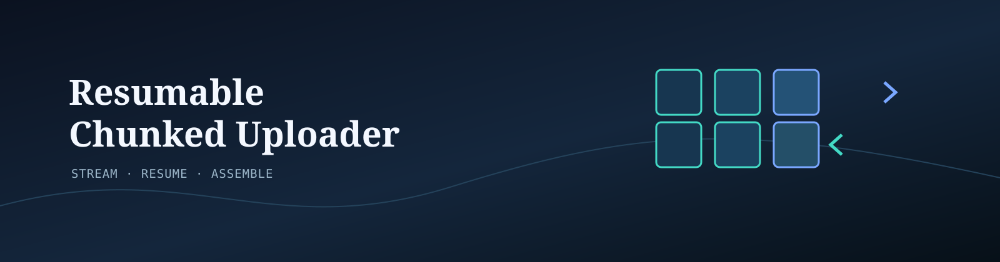
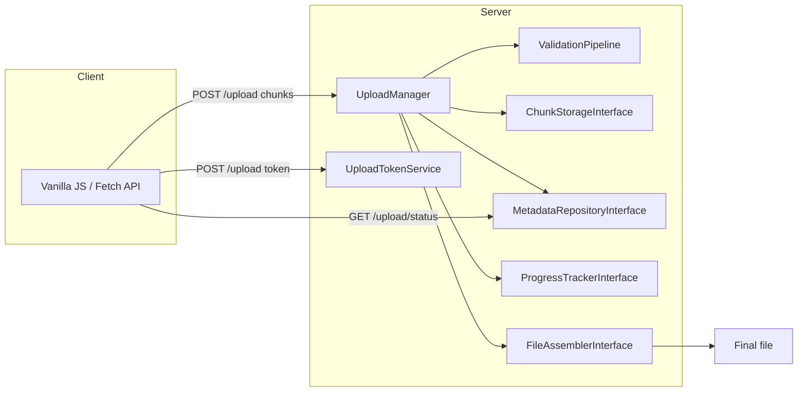
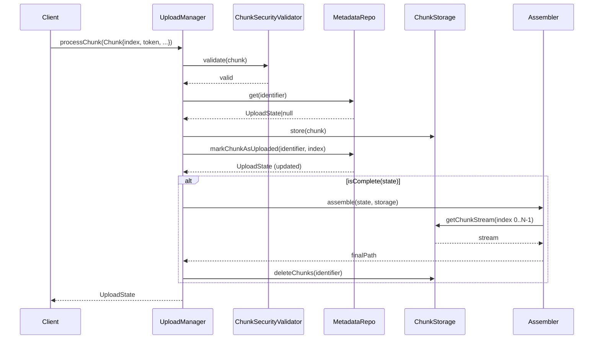

<!--
    RESUMABLE CHUNKED UPLOADER
    ==========================
    Stream. Resume. Assemble.
-->

# Resumable Chunked Uploader

[](https://www.php.net/releases/)
[](LICENSE)
[](https://phpunit.de/)

Enterprise-grade, framework-agnostic PHP 8.2 library for handling large file
uploads via **chunking** with **constant-memory stream assembly**, **resume
capability**, and **cryptographic integrity checks**.

Chunks are persisted independently, progress is kept in a durable store
(Redis or a relational database), and the final file is assembled using native
PHP streams — never buffering the whole file into memory, regardless of how
large it is.

---

## Table of contents

- [Highlights](#highlights)
- [Architecture](#architecture)
- [Core benefits](#core-benefits)
- [Installation](#installation)
- [Standalone PHP quickstart](#standalone-php-quickstart)
- [Framework integration](#framework-integration)
  - [Laravel 10 / 11](#laravel-10--11)
  - [Symfony 6 / 7](#symfony-6--7)
- [Vanilla JavaScript client](#vanilla-javascript-client)
- [Security model](#security-model)
- [API reference](#api-reference)
- [Configuration options](#configuration-options)
- [Testing](#testing)
- [License](#license)

---

## Highlights

- **O(1) memory** chunk assembly via `fopen()` + `stream_copy_to_stream()`.
- **Resume support** for out-of-order chunks and interrupted requests.
- **Atomic** progress updates in Redis (optimistic locking).
- **HMAC tokens** bound to upload metadata and client context.
- **Magic-byte MIME validation** (only reads the first 4096 bytes).
- **Strict path sanitization** against directory traversal.
- **Optional** ClamAV scanning and Redis rate limiting.
- **Atomic failure cleanup** removes a stored chunk when its metadata update
    fails, so transient database errors do not create permanent orphan bytes.
- **Bounded cleanup** scans local directories, S3 pages, Redis cursors, and PDO
    rows incrementally, including S3 deletion batches larger than 1,000 objects.
- **`ChunkUploader`** is the canonical coordinator; `UploadManager` remains a
    deprecated compatibility alias for existing 1.x applications.
- **Optional PHP 8 attributes** provide endpoint-specific immutable config
    overrides without changing global defaults.
- **Flysystem v3** storage is available as an optional driver.
- **Zero framework dependency** in the core package.
- **Laravel** and **Symfony** bridges + a **dependency-free vanilla JS** client.

---

## Architecture



Data flow for a single chunk:



---

## Core benefits

| Benefit | How it works |
| --- | --- |
| **Low memory** | Assembly streams chunk-by-chunk through a fixed 4 MiB buffer. A 10 GB file needs under 10 MiB of PHP memory. |
| **Resumable** | Progress persists per-chunk. Any client can query missing indices and resume exactly where it stopped. |
| **Idempotent** | Re-sending an already-accepted chunk is a no-op — no duplicated bytes, no corruption. |
| **Secure** | Magic-byte MIME checks, HMAC token verification, traversal-safe paths, and optional ClamAV scanning. |
| **Out-of-order safe** | Chunks may arrive in any order; assembly only runs when every index is present. |

---

## Installation

```bash
composer require resumable/chunked-uploader
```

Requirements:

- PHP **^8.2**
- `ext-json`
- One of `ext-redis` **or** `predis/predis` (for the Redis metadata driver)
- `ext-pdo` (for the PDO metadata driver)
- `aws/aws-sdk-php` (for the S3 storage driver)

---

## Standalone PHP quickstart

```php
<?php

declare(strict_types=1);

use Resumable\ChunkedUploader\Core\Assembler\StreamAssembler;
use Resumable\ChunkedUploader\Core\Drivers\Metadata\RedisMetadataRepository;
use Resumable\ChunkedUploader\Core\Drivers\Storage\LocalChunkStorage;
use Resumable\ChunkedUploader\Core\Models\Chunk;
use Resumable\ChunkedUploader\Core\Security\PathSanitizer;
use Resumable\ChunkedUploader\Core\Security\UploadTokenService;
use Resumable\ChunkedUploader\Core\UploadManager;
use Resumable\ChunkedUploader\Core\Validation\ChunkSecurityValidator;
use Resumable\ChunkedUploader\Core\Validation\ValidationPipeline;
use Resumable\ChunkedUploader\Core\Contracts\EventDispatcherInterface;
use Resumable\ChunkedUploader\Core\Contracts\FileAssemblerInterface;
use Resumable\ChunkedUploader\Core\Contracts\ProgressTrackerInterface;
use Resumable\ChunkedUploader\Core\Contracts\ChunkValidatorInterface;
use Resumable\ChunkedUploader\Core\Contracts\ChunkStorageInterface;
use Resumable\ChunkedUploader\Core\Contracts\MetadataRepositoryInterface;
use Resumable\ChunkedUploader\Core\Exceptions\ChunkUploaderException;

// 1. Wire the infrastructure.
$storage = new LocalChunkStorage('/var/lib/my-app/chunks', new PathSanitizer());
$metadata = new RedisMetadataRepository(new \Redis(['host' => '127.0.0.1']));

$assembler = new StreamAssembler('/var/lib/my-app/final');
$validator = new ChunkSecurityValidator(
    sanitizer: new PathSanitizer(),
    pipeline: new ValidationPipeline([]),
    tokenService: new UploadTokenService($_ENV['UPLOAD_TOKEN_SECRET']),
);

// 2. Create the manager once, inject it into your request handler.
$manager = new UploadManager(
    storage: $storage,
    metadata: $metadata,
    progress: $metadata,
    assembler: $assembler,
    validator: $validator,
    dispatcher: new class implements EventDispatcherInterface {
        public function dispatch(object $event): object { return $event; }
    },
);

// 3. Issue a token bound to the upload signature and client context.
$token = (new UploadTokenService($_ENV['UPLOAD_TOKEN_SECRET']))
    ->createToken('upload_123', 4, 20_000_000, 'client-context');

// 4. For each incoming chunk, build a Chunk DTO and process it.
try {
    $state = $manager->processChunk(new Chunk(
        identifier: 'upload_123',
        token: $token,
        index: 0,
        totalChunks: 4,
        chunkSize: filesize($tempFile), // actual byte size of this chunk
        totalSize: 20_000_000,          // expected total size
        tmpFilePath: $tempFile,         // from PHP's upload temp dir
        originalFilename: 'archive.zip',
    ));
} catch (ChunkUploaderException $e) {
    // validation / storage / assembly failure
}

// The manager returns the latest upload state; when isCompleted is true the
// final file has been assembled and temp chunks deleted.
if ($state->isCompleted) {
    // finalPath points to the assembled artifact
    echo $state->finalPath;
}
```

Create one `Chunk` per HTTP request. `index` is zero-based. Retrying an
already-accepted index is safe and idempotent.

---

## Framework integration

### Laravel 10 / 11

**1. Register the service provider**

In `bootstrap/providers.php` (Laravel 11) or `config/app.php` (Laravel 10):

```php
// Laravel 11: bootstrap/providers.php
return [
    Resumable\ChunkedUploader\Bridge\Laravel\Providers\ChunkUploaderServiceProvider::class,
];

// Laravel 10: config/app.php
'providers' => [
    Resumable\ChunkedUploader\Bridge\Laravel\Providers\ChunkUploaderServiceProvider::class,
],
```

**2. Publish configuration (optional)**

```bash
php artisan vendor:publish --provider="Resumable\ChunkedUploader\Bridge\Laravel\Providers\ChunkUploaderServiceProvider"
```

Then adjust `config/chunk-uploader.php` (allowed MIME types, spool directory,
storage driver, etc.).

New in this version: `token_salt` (binds tokens to a client fingerprint),
`virus_scanning` (ClamAV host/port), and `rate_limiting` (Redis-backed chunk
flood protection) — all with matching `.env` variable names (see the config
file for the full list).

**3. Use the Facade**

```php
use Resumable\ChunkedUploader\Bridge\Laravel\Facades\ChunkUploader;

$state = ChunkUploader::processChunk($chunk);
```

**4. Add routes (see the example controller)**

```php
Route::post('/upload/token',  [ChunkUploadController::class, 'issueToken']);
Route::post('/upload',        [ChunkUploadController::class, 'store']);
Route::get('/upload/status/{identifier}', [ChunkUploadController::class, 'status']);
```

A complete, copy-pasteable controller lives at
[`examples/laravel/ChunkUploadController.php`](examples/laravel/ChunkUploadController.php).

---

### Symfony 6 / 7

**1. Enable the bundle**

```php
// config/bundles.php
return [
    Resumable\ChunkedUploader\Bridge\Symfony\ChunkUploaderBundle::class => ['all' => true],
];
```

**2. Configure the bundle**

```yaml
# config/packages/chunk_uploader.yaml
chunk_uploader:
    max_chunk_size: 5242880
    max_file_size: 104857600
    max_chunks: 1000
    allowed_mime_types: []
    spool_directory: '%kernel.project_dir%/var/chunked-uploader'
    garbage_collection_ttl: 3600
    token_secret: '%env(APP_SECRET)%'
    token_salt: '%env(APP_SECRET)%'       # optional client-fingerprint salt
    storage: local                         # local | s3
    local:
        base_directory: '%kernel.project_dir%/var/chunked-uploader/chunks'
    s3:
        bucket: 'my-bucket'
        prefix: 'chunks/'
        config: { version: latest, region: eu-west-1, key: ~, secret: ~ }
    metadata: redis                        # redis | pdo
    redis:
        client: phpredis                   # phpredis | predis
        prefix: 'chunked-uploader:'
        ttl: 0
        connection_service: 'redis'        # required when rate limiting is enabled
    pdo:
        table: chunked_upload_states
        connection: default
    virus_scanning:
        enabled: false
        host: '127.0.0.1'
        port: 3310
    rate_limiting:
        enabled: false
        max_attempts: 100
        decay_seconds: 60
        key: 'chunked-uploader:chunks'
```

**3. Add routes via attribute on the controller**

The example at [`examples/symfony/ChunkUploadController.php`](examples/symfony/ChunkUploadController.php)
uses attribute routing and constructor injection, so no routing YAML is needed.

---

## Vanilla JavaScript client

A 100% dependency-free ES6+ client, using `Blob.prototype.slice()`, the Fetch
API and `FormData`, is included in [`examples/vanilla-js/`](examples/vanilla-js/).

```html
<script src="uploader.js"></script>
```

```js
const uploader = new ChunkedUploader({
  file,
  endpoint: '/upload',
  chunkSize: 2 * 1024 * 1024,          // 2 MiB
  token,                                // HMAC token from your backend
  onProgress: (percent, index, total) => {
    progressBar.value = percent;
  },
  onSuccess: (result) => console.log('Done', result),
  onError: (error) => console.error(error),
});

await uploader.start();          // also valid: await uploader.resume()
```

Features:

- Splits a `File` into binary chunks with `file.slice(start, end)`.
- Sends each chunk as `multipart/form-data` via `fetch()`.
- Automatic retry with **exponential backoff** on transient failures.
- `pause()` / `resume()` for interactive control.
- `missingChunks()` queries `GET {endpoint}/status/{id}` so a partially
  uploaded file resumes instead of restarting.
- Works in any modern browser with native `fetch`, `FormData`, and `Blob`.

Open [`examples/vanilla-js/index.html`](examples/vanilla-js/index.html) in a
browser for a ready-to-run drag-and-drop demo.

---

## Security model

1. **Tokens** — `UploadTokenService` issues HMAC-SHA256 tokens bound to the
   upload identifier, chunk count, total size, and an optional client salt
   (IP / fingerprint). Verification uses `hash_equals()` (constant-time).
2. **Paths** — `PathSanitizer` rejects null bytes, directory separators,
   traversal markers (`..`, `../`), and unsafe identifiers. Never build a
   filesystem path from user input without running it through the sanitizer.
3. **MIME** — `MagicByteValidator` inspects only the first 4096 bytes via
   `finfo` and compares against an allow-list. Client-supplied MIME headers
   are never trusted.
4. **Extension matching** — `ExtensionMimeMatchRule` rejects files whose
   claimed extension disagrees with their detected MIME type.
5. **Malware** — `ClamAvScanner` streams data to `clamd` over the INSTREAM
   protocol in 1 MiB chunks. Use `NullVirusScanner` when scanning is handled
   elsewhere.
6. **Abuse** — `RedisRateLimiter` can key limits per IP, user, or upload token
   and applies them before accepting chunk bodies.
7. **Storage** — Keep temporary and final directories outside the public
   document root, and configure permissions and retention deliberately.

---

## API reference

### `UploadManagerInterface`

| Method | Description |
| --- | --- |
| `processChunk(Chunk $chunk): UploadState` | Validates the token, persists the chunk, advances progress, and assembles when complete. Idempotent and concurrent-safe. |
| `cancelUpload(string $identifier): void` | Removes chunks and metadata. Idempotent for unknown identifiers. |
| `getStatus(string $identifier): ?UploadState` | Reads the current state of an upload, or null if unknown. |

### `Chunk` (readonly DTO)

`identifier`, `token`, `index`, `totalChunks`, `chunkSize`, `totalSize`,
`tmpFilePath`, `originalFilename`, and optional `checksum`.

### `UploadState` (readonly DTO)

`identifier`, `totalChunks`, `totalSize`, `originalFilename`, `uploadedChunks`,
`isCompleted`, `finalPath`; plus `hasChunk()`, `isComplete()`,
`withUploadedChunk()`, and `withFinalPath()`.

### Contracts

| Contract | Methods |
| --- | --- |
| `ChunkStorageInterface` | `store`, `getChunkStream`, `deleteChunks`, `cleanOrphanedChunks` |
| `MetadataRepositoryInterface` | `save`, `get`, `delete`, `markChunkAsUploaded`, `cleanExpired` |
| `ProgressTrackerInterface` | `getPercentage`, `isComplete`, `getMissingChunkIndices` |
| `FileAssemblerInterface` | `assemble(UploadState, ChunkStorageInterface): string` |
| `ValidationRuleInterface` | `validate(Chunk): void` |
| `ChunkValidatorInterface` | `validate(Chunk): bool` |
| `VirusScannerInterface` | `scan(string): void` |
| `EventDispatcherInterface` | `dispatch(object): object` |

---

## Endpoint-specific attributes

Global Laravel or Symfony configuration remains the default. A controller
method can opt into a narrower immutable configuration for its own uploads:

```php
use Resumable\ChunkedUploader\Core\Attributes\ChunkedUpload;

final class MediaController
{
    #[ChunkedUpload(
        maxFileSize: 50 * 1024 * 1024,
        allowedMimeTypes: ['video/mp4'],
        tokenSalt: 'media-endpoint',
    )]
    public function upload(): void
    {
        // Resolve the method with ChunkedUploadConfigResolver in the bridge,
        // then pass the returned UploaderConfig to ChunkUploader::processChunk.
    }
}
```

The core resolver accepts either a `ReflectionMethod` or `ReflectionClass` and
returns the unchanged global instance when no attribute is present.

## Configuration options

| Setting | Default | Description |
| --- | --- | --- |
| `maxChunkSize` | 5 MiB | Hard limit of a single chunk. |
| `maxFileSize` | 100 MiB | Hard limit of the assembled file. |
| `maxChunks` | 1000 | Max chunks per upload (DoS guard). |
| `allowedMimeTypes` | `[]` | Whitelist; empty = any verified type. |
| `spoolDirectory` | `/tmp/chunked-uploader` | Chunk + final assembly dir. |
| `garbageCollectionTtl` | 3600 s | Incomplete-upload window before GC. |
| `identifierPattern` | `^[a-zA-Z0-9_-]{1,128}$` | Legal identifier pattern. |
| `tokenSalt` | `''` | Optional HMAC salt bound to client context. |
| `virusScanning` | disabled | ClamAV host/port (requires `virus_scanning.enabled: true`). |
| `rateLimiting` | disabled | Redis-backed chunk-flood guard (`max_attempts`, `decay_seconds`, `key`). |

---

## Testing

```bash
composer install
vendor/bin/phpunit
```

The full suite runs **completely offline**: all disk I/O uses ephemeral
temporary files that are cleaned up automatically; storage and metadata are
in-memory doubles (FakeRedis, FakePdo); and Redis, S3, and ClamAV are never
contacted. The suite covers:

- **Unit tests** against `PathSanitizer`, `MagicByteValidator`,
  `UploadTokenService`, `StreamAssembler` (memory ceiling), `ClamAvScanner`
  (stream-pair seam), `RedisRateLimiter`, `S3ChunkStorage`, and
  `PdoMetadataRepository` (with Postgres/MySQL dialect assertions).
- **Feature tests** for the full sequential upload flow, out-of-order
  resumable uploads, interrupted-upload recovery (idempotent retries,
  resume-from-missing-index, service-restart continuity), and both the
  Laravel and Symfony framework bridges.

## License

MIT. See [`LICENSE`](LICENSE).
