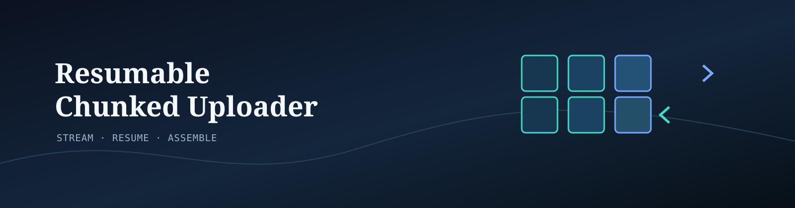
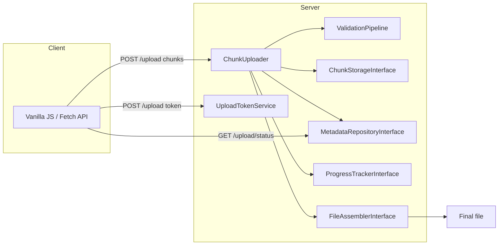
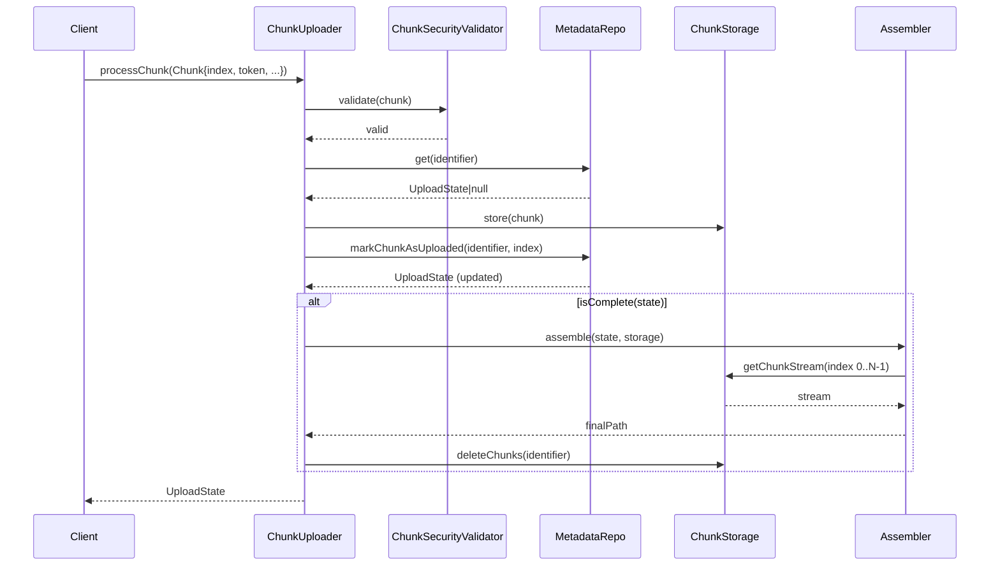

<!--
    RESUMABLE CHUNKED UPLOADER
    ==========================
    Stream. Resume. Assemble.
-->

# Resumable Chunked Uploader

[](https://www.php.net/releases/)
[](LICENSE)
[](https://phpunit.de/)

Enterprise-grade, framework-agnostic PHP 8.2 library for handling large file
uploads via **chunking** with **constant-memory stream assembly**, **resume
capability**, and **cryptographic integrity checks**.

Chunks are persisted independently, progress is kept in a durable store
(Redis or a relational database), and the final file is assembled using native
PHP streams — never buffering the whole file into memory, regardless of how
large it is.

---

## Table of contents

- [Highlights](#highlights)
- [Architecture](#architecture)
- [Core benefits](#core-benefits)
- [Installation](#installation)
- [Standalone PHP quickstart](#standalone-php-quickstart)
- [Framework integration](#framework-integration)
  - [Laravel 10 / 11](#laravel-10--11)
  - [Symfony 6 / 7](#symfony-6--7)
- [Vanilla JavaScript client](#vanilla-javascript-client)
- [Security model](#security-model)
- [Native S3 multipart assembly](#native-s3-multipart-assembly)
- [Concurrent assembly (distributed locking)](#concurrent-assembly-distributed-locking)
- [End-to-end chunk checksums](#end-to-end-chunk-checksums)
- [Metrics](#metrics)
- [API reference](#api-reference)
- [Configuration options](#configuration-options)
- [Testing](#testing)
- [License](#license)

---

## Highlights

- **O(1) memory** chunk assembly via `fopen()` + `stream_copy_to_stream()`.
- **Native S3 multipart assembly** — the object store concatenates the parts via
    `CreateMultipartUpload` / `UploadPart` / `CompleteMultipartUpload`, so the PHP
    server never downloads or re-streams the assembled object. Per-chunk resource
    use is independent of total file size.
- **End-to-end checksums** — the browser's SHA-256/MD5 digest is forwarded to S3
    as `ChecksumSHA256` / `ContentMD5`, so the store verifies the bytes it
    actually received, not just the bytes your server received.
- **Distributed assembly lock** (Redis or PDO) with a TTL/2 **heartbeat** that
    renews long assemblies, plus a post-assembly ownership check that refuses to
    publish a file a competing node may also be producing.
- **Pluggable telemetry** via `MetricsTrackerInterface` — Prometheus, StatsD, or
    OpenTelemetry, with a no-op bound by default.
- **Resume support** for out-of-order chunks and interrupted requests.
- **Atomic** progress updates in Redis (optimistic locking).
- **HMAC tokens** bound to upload metadata and client context.
- **Magic-byte MIME validation** (only reads the first 4096 bytes).
- **Strict path sanitization** against directory traversal.
- **Optional** ClamAV scanning and Redis rate limiting.
- **Atomic failure cleanup** removes a stored chunk when its metadata update
    fails, so transient database errors do not create permanent orphan bytes.
- **Bounded cleanup** scans local directories, S3 pages, Redis cursors, and PDO
    rows incrementally, including S3 deletion batches larger than 1,000 objects.
    The S3 sweeper also aborts stale multipart uploads, whose parts are invisible
    to a normal object listing and would otherwise keep accruing storage cost.
- **`ChunkUploader`** is the single canonical coordinator.
- **Optional PHP 8 attributes** provide endpoint-specific immutable config
    overrides without changing global defaults.
- **Flysystem v3** storage is available as an optional driver.
- **Zero framework dependency** in the core package.
- **Laravel** and **Symfony** bridges + a **dependency-free vanilla JS** client.

---

## Architecture


```mermaid
flowchart LR
    subgraph Client
        JS[Vanilla JS / Fetch API]
    end

    subgraph Server
        M[ChunkUploader]
        V[ValidationPipeline]
        S[ChunkStorageInterface]
        MD[MetadataRepositoryInterface]
        PT[ProgressTrackerInterface]
        A[FileAssemblerInterface]
        TS[UploadTokenService]
    end

    JS -->|POST /upload token| TS
    JS -->|POST /upload chunks| M
    M --> V
    M --> S
    M --> MD
    M --> PT
    M --> A
    A --> F[Final file]
    JS -->|GET /upload/status| MD
```

Data flow for a single chunk:


```mermaid
sequenceDiagram
    participant C as Client
    participant M as ChunkUploader
    participant TS as ChunkSecurityValidator
    participant MD as MetadataRepo
    participant S as ChunkStorage
    participant A as Assembler

    C->>M: processChunk(Chunk{index, token, ...})
    M->>TS: validate(chunk)
    TS-->>M: valid
    M->>MD: get(identifier)
    MD-->>M: UploadState|null
    M->>S: store(chunk)
    M->>MD: markChunkAsUploaded(identifier, index)
    MD-->>M: UploadState (updated)
    alt isComplete(state)
        M->>A: assemble(state, storage)
        A->>S: getChunkStream(index 0..N-1)
        S-->>A: stream
        A-->>M: finalPath
        M->>S: deleteChunks(identifier)
    end
    M-->>C: UploadState
```

---

## Core benefits

| Benefit | How it works |
| --- | --- |
| **Low memory** | Assembly streams chunk-by-chunk through a fixed 4 MiB buffer. A 10 GB file needs under 10 MiB of PHP memory. |
| **Resumable** | Progress persists per-chunk. Any client can query missing indices and resume exactly where it stopped. |
| **Idempotent** | Re-sending an already-accepted chunk is a no-op — no duplicated bytes, no corruption. |
| **Secure** | Magic-byte MIME checks, HMAC token verification, traversal-safe paths, and optional ClamAV scanning. |
| **Out-of-order safe** | Chunks may arrive in any order; assembly only runs when every index is present. |

---

## Installation

```bash
composer require resumable/chunked-uploader
```

Requirements:

- PHP **^8.2**
- `ext-json`
- One of `ext-redis` **or** `predis/predis` (for the Redis metadata driver)
- `ext-pdo` (for the PDO metadata driver)
- `aws/aws-sdk-php` (for the S3 storage driver)

---

## Standalone PHP quickstart

```php
<?php

declare(strict_types=1);

use Resumable\ChunkedUploader\Core\Assembler\StreamAssembler;
use Resumable\ChunkedUploader\Core\Drivers\Metadata\RedisMetadataRepository;
use Resumable\ChunkedUploader\Core\Drivers\Storage\LocalChunkStorage;
use Resumable\ChunkedUploader\Core\Models\Chunk;
use Resumable\ChunkedUploader\Core\Security\PathSanitizer;
use Resumable\ChunkedUploader\Core\Security\UploadTokenService;
use Resumable\ChunkedUploader\Core\ChunkUploader;
use Resumable\ChunkedUploader\Core\Validation\ChunkSecurityValidator;
use Resumable\ChunkedUploader\Core\Validation\ValidationPipeline;
use Resumable\ChunkedUploader\Core\Contracts\EventDispatcherInterface;
use Resumable\ChunkedUploader\Core\Contracts\FileAssemblerInterface;
use Resumable\ChunkedUploader\Core\Contracts\ProgressTrackerInterface;
use Resumable\ChunkedUploader\Core\Contracts\ChunkValidatorInterface;
use Resumable\ChunkedUploader\Core\Contracts\ChunkStorageInterface;
use Resumable\ChunkedUploader\Core\Contracts\MetadataRepositoryInterface;
use Resumable\ChunkedUploader\Core\Exceptions\ChunkUploaderException;

// 1. Wire the infrastructure.
$storage = new LocalChunkStorage('/var/lib/my-app/chunks', new PathSanitizer());
$metadata = new RedisMetadataRepository(new \Redis(['host' => '127.0.0.1']));

$assembler = new StreamAssembler('/var/lib/my-app/final');
$validator = new ChunkSecurityValidator(
    sanitizer: new PathSanitizer(),
    pipeline: new ValidationPipeline([]),
    tokenService: new UploadTokenService($_ENV['UPLOAD_TOKEN_SECRET']),
);

// 2. Create the manager once, inject it into your request handler.
$manager = new ChunkUploader(
    storage: $storage,
    metadata: $metadata,
    progress: $metadata,
    assembler: $assembler,
    validator: $validator,
    dispatcher: new class implements EventDispatcherInterface {
        public function dispatch(object $event): object { return $event; }
    },
);

// 3. Issue a token bound to the upload signature and client context.
$token = (new UploadTokenService($_ENV['UPLOAD_TOKEN_SECRET']))
    ->createToken('upload_123', 4, 20_000_000, 'client-context');

// 4. For each incoming chunk, build a Chunk DTO and process it.
try {
    $state = $manager->processChunk(new Chunk(
        identifier: 'upload_123',
        token: $token,
        index: 0,
        totalChunks: 4,
        chunkSize: filesize($tempFile), // actual byte size of this chunk
        totalSize: 20_000_000,          // expected total size
        tmpFilePath: $tempFile,         // from PHP's upload temp dir
        originalFilename: 'archive.zip',
    ));
} catch (ChunkUploaderException $e) {
    // validation / storage / assembly failure
}

// The manager returns the latest upload state; when isCompleted is true the
// final file has been assembled and temp chunks deleted.
if ($state->isCompleted) {
    // finalPath points to the assembled artifact
    echo $state->finalPath;
}
```

Create one `Chunk` per HTTP request. `index` is zero-based. Retrying an
already-accepted index is safe and idempotent.

---

## Framework integration

### Laravel 10 / 11

**1. Register the service provider**

In `bootstrap/providers.php` (Laravel 11) or `config/app.php` (Laravel 10):

```php
// Laravel 11: bootstrap/providers.php
return [
    Resumable\ChunkedUploader\Bridge\Laravel\Providers\ChunkUploaderServiceProvider::class,
];

// Laravel 10: config/app.php
'providers' => [
    Resumable\ChunkedUploader\Bridge\Laravel\Providers\ChunkUploaderServiceProvider::class,
],
```

**2. Publish configuration (optional)**

```bash
php artisan vendor:publish --provider="Resumable\ChunkedUploader\Bridge\Laravel\Providers\ChunkUploaderServiceProvider"
```

Then adjust `config/chunk-uploader.php`. The keys most deployments change:

```php
return [
    'max_chunk_size' => 5 * 1024 * 1024,   // raise to match the client's chunkSize
    'max_file_size'  => 100 * 1024 * 1024,
    'max_chunks'     => 1000,
    'allowed_mime_types' => [],             // empty = any type with verifiable magic bytes
    'spool_directory'    => storage_path('app/chunked-uploader'),
    'garbage_collection_ttl' => 3600,

    'token_secret' => env('CHUNK_UPLOADER_TOKEN_SECRET', env('APP_KEY', '')),
    'token_salt'   => env('CHUNK_UPLOADER_TOKEN_SALT', ''),

    'storage' => 'local',                  // local | s3
    's3' => [
        'bucket'  => env('CHUNK_UPLOADER_S3_BUCKET', ''),
        'prefix'  => env('CHUNK_UPLOADER_S3_PREFIX', 'chunks/'),
        'final_prefix' => env('CHUNK_UPLOADER_S3_FINAL_PREFIX', 'uploads/'),
        'config'  => [
            'version'     => env('AWS_VERSION', 'latest'),
            'region'      => env('AWS_DEFAULT_REGION', 'us-east-1'),
            'credentials' => [
                'key'    => env('AWS_ACCESS_KEY_ID', ''),
                'secret' => env('AWS_SECRET_ACCESS_KEY', ''),
            ],
        ],
    ],

    'metadata' => 'redis',                 // redis | pdo

    // Where a client digest is checked. Use 'storage' with the S3 driver so the
    // part is verified by S3 in the request that stores it, instead of hashing
    // every chunk twice.
    'checksum_verify' => env('CHUNK_UPLOADER_CHECKSUM_VERIFY', 'local'),  // local | storage

    // Distributed assembly lock. The lock follows the 'metadata' driver above
    // and reuses its connection; there is no separate lock_driver to configure.
    'assembly_lock' => [
        'ttl'          => (int) env('CHUNK_UPLOADER_ASSEMBLY_LOCK_TTL', 60),
        'wait_seconds' => (int) env('CHUNK_UPLOADER_ASSEMBLY_LOCK_WAIT', 10),
    ],

    'virus_scanning' => [
        'enabled' => env('CHUNK_UPLOADER_VIRUS_SCANNING', false),
        'host'    => env('CHUNK_UPLOADER_CLAMAV_HOST', '127.0.0.1'),
        'port'    => (int) env('CHUNK_UPLOADER_CLAMAV_PORT', 3310),
    ],

    'rate_limiting' => [
        'enabled'        => env('CHUNK_UPLOADER_RATE_LIMITING', false),
        'max_attempts'   => (int) env('CHUNK_UPLOADER_RATE_LIMIT_MAX', 100),
        'decay_seconds'  => (int) env('CHUNK_UPLOADER_RATE_LIMIT_WINDOW', 60),
        'key'            => env('CHUNK_UPLOADER_RATE_LIMIT_KEY', 'chunked-uploader:chunks'),
    ],
];
```

Telemetry needs no key: `NullMetricsTracker` is bound by default, and you opt in
by binding your own `MetricsTrackerInterface` (see [Metrics](#metrics)).

Two of these deserve emphasis:

- **`checksum_verify: storage` on S3.** Leaving it on `local` hashes every chunk
  twice — once in PHP against the temp file, again inside S3 — for no extra
  coverage. Set `CHUNK_UPLOADER_CHECKSUM_VERIFY=storage` in `.env`.
- **`assembly_lock.ttl` is renewed automatically.** Assemblers that checkpoint
  extend the lease every `ttl / 2`, so the value no longer has to exceed your
  slowest realistic assembly. Assemblers that cannot checkpoint — including the
  built-in `S3MultipartAssembler` — are not renewed, so for those keep `ttl` above
  the whole operation. See
  [Concurrent assembly](#concurrent-assembly-distributed-locking).

**3. Use the Facade**

```php
use Resumable\ChunkedUploader\Bridge\Laravel\Facades\ChunkUploader;

$state = ChunkUploader::processChunk($chunk);
```

**4. Add routes (see the example controller)**

```php
Route::post('/upload/token',  [ChunkUploadController::class, 'issueToken']);
Route::post('/upload',        [ChunkUploadController::class, 'store']);
Route::get('/upload/status/{identifier}', [ChunkUploadController::class, 'status']);
```

A complete, copy-pasteable controller lives at
[`examples/laravel/ChunkUploadController.php`](examples/laravel/ChunkUploadController.php).

---

### Symfony 6 / 7

**1. Enable the bundle**

```php
// config/bundles.php
return [
    Resumable\ChunkedUploader\Bridge\Symfony\ChunkUploaderBundle::class => ['all' => true],
];
```

**2. Configure the bundle**

```yaml
# config/packages/chunk_uploader.yaml
chunk_uploader:
    max_chunk_size: 5242880
    max_file_size: 104857600
    max_chunks: 1000
    allowed_mime_types: []
    spool_directory: '%kernel.project_dir%/var/chunked-uploader'
    garbage_collection_ttl: 3600
    token_secret: '%env(APP_SECRET)%'
    token_salt: '%env(APP_SECRET)%'       # optional client-fingerprint salt
    storage: local                         # local | s3
    local:
        base_directory: '%kernel.project_dir%/var/chunked-uploader/chunks'
    s3:
        bucket: 'my-bucket'
        prefix: 'chunks/'
        final_prefix: 'uploads/'            # where the assembled object is written
        config: { version: latest, region: eu-west-1, key: ~, secret: ~ }
    metadata: redis                        # redis | pdo
    redis:
        client: phpredis                   # phpredis | predis
        prefix: 'chunked-uploader:'
        ttl: 0
        connection_service: 'redis'        # required when rate limiting is enabled
    pdo:
        table: chunked_upload_states
        connection: default
    virus_scanning:
        enabled: false
        host: '127.0.0.1'
        port: 3310
    rate_limiting:
        enabled: false
        max_attempts: 100
        decay_seconds: 60
        key: 'chunked-uploader:chunks'
    assembly_lock:
        ttl: 60                        # lease length, renewed every ttl/2
        wait_seconds: 10               # how long a loser polls for the winner
    checksum_verify: local             # local | storage  (use 'storage' with S3)
```

> **Using `storage: s3`?** Assembly is handed to the object store rather than
> performed by PHP, and **the client chunk size must be at least 5 MiB**.
> See [Native S3 multipart assembly](#native-s3-multipart-assembly) before your
> first S3 upload.

**3. Add routes via attribute on the controller**

The example at [`examples/symfony/ChunkUploadController.php`](examples/symfony/ChunkUploadController.php)
uses attribute routing and constructor injection, so no routing YAML is needed.

---

## Vanilla JavaScript client

> **Looking for the client?** The production-grade, typed TypeScript client now
> lives in [`js-client/`](js-client/) and is published as
> `chunked-uploader-client`. It is strictly dependency-free, ships
> ESM + CJS + type declarations, and speaks the exact same wire protocol. Use it
> in new projects; the single-file demo below is retained only so the backend can
> be exercised with no build step.

A 100% dependency-free ES6+ client, using `Blob.prototype.slice()`, the Fetch
API and `FormData`, is included in [`examples/vanilla-js/`](examples/vanilla-js/).

```html
<script src="uploader.js"></script>
```

```js
const uploader = new ChunkedUploader({
  file,
  endpoint: '/upload',
  chunkSize: 2 * 1024 * 1024,          // 2 MiB
  token,                                // HMAC token from your backend
  onProgress: (percent, index, total) => {
    progressBar.value = percent;
  },
  onSuccess: (result) => console.log('Done', result),
  onError: (error) => console.error(error),
});

await uploader.start();          // also valid: await uploader.resume()
```

> The 2 MiB default suits the local driver. **Against the S3 driver you must raise
> it to at least 5 MiB** — see
> [Native S3 multipart assembly](#native-s3-multipart-assembly).

Features:

- Splits a `File` into binary chunks with `file.slice(start, end)`.
- Sends each chunk as `multipart/form-data` via `fetch()`.
- Automatic retry with **exponential backoff** on transient failures.
- `pause()` / `resume()` for interactive control.
- `missingChunks()` queries `GET {endpoint}/status/{id}` so a partially
  uploaded file resumes instead of restarting.
- Works in any modern browser with native `fetch`, `FormData`, and `Blob`.

Open [`examples/vanilla-js/index.html`](examples/vanilla-js/index.html) in a
browser for a ready-to-run drag-and-drop demo.

---

## Security model

1. **Tokens** — `UploadTokenService` issues HMAC-SHA256 tokens bound to the
   upload identifier, chunk count, total size, and an optional client salt
   (IP / fingerprint). Verification uses `hash_equals()` (constant-time).
2. **Paths** — `PathSanitizer` rejects null bytes, directory separators,
   traversal markers (`..`, `../`), and unsafe identifiers. Never build a
   filesystem path from user input without running it through the sanitizer.
3. **MIME** — `MagicByteValidator` inspects only the first 4096 bytes via
   `finfo` and compares against an allow-list. Client-supplied MIME headers
   are never trusted.
4. **Extension matching** — `ExtensionMimeMatchRule` rejects files whose
   claimed extension disagrees with their detected MIME type.
5. **Malware** — `ClamAvScanner` streams data to `clamd` over the INSTREAM
   protocol in 1 MiB chunks. Use `NullVirusScanner` when scanning is handled
   elsewhere.
6. **Abuse** — `RedisRateLimiter` can key limits per IP, user, or upload token
   and applies them before accepting chunk bodies.
7. **Storage** — Keep temporary and final directories outside the public
   document root, and configure permissions and retention deliberately.

---

## Native S3 multipart assembly

With `storage: s3`, assembly is not something PHP does. The first chunk opens a
`CreateMultipartUpload`, every chunk is sent as an `UploadPart`, and
`S3MultipartAssembler` finishes with a single `CompleteMultipartUpload` that asks
the object store to concatenate the parts:

```text
chunk 0  ──UploadPart 1──┐
chunk 1  ──UploadPart 2──┤
chunk 2  ──UploadPart 3──┼──▶  S3  ──CompleteMultipartUpload──▶  final object
   ...                     │
chunk n  ──UploadPart n+1─┘
```

The server streams each chunk to S3 exactly once and then forgets about it. It
never downloads the parts back, never concatenates them locally, and never
writes the assembled file to its own disk. **Resource use is therefore bounded
by a single chunk and is independent of total file size** — a 50 GB upload costs
the PHP server the same working set as a 50 MB one. Compare with the local
driver, where `StreamAssembler` must move every byte through the server to build
the final file, and with the naive S3 approach of downloading each part, joining
them, and re-uploading the result, which moves the entire file over the network
three times.

The `UploadId` and each part's `ETag` are recorded in the metadata repository,
which is what lets an interrupted upload resume across requests and web nodes
rather than starting over. `S3ChunkStorage` and `S3MultipartAssembler` resolve
the destination key from a single helper, so the driver that writes parts and
the assembler that completes them cannot disagree about where the object lands.

Works against AWS S3 and MinIO, since both implement the multipart API.

> [!WARNING]
> **S3 requires every part except the last to be at least 5 MiB**, and permits at
> most 10,000 parts. The bundled JavaScript client defaults to a **2 MiB**
> `chunkSize`, which is *below* that minimum — so a default client against
> `storage: s3` fails on every multi-chunk upload. **Raise `chunkSize` to at
> least 5 MiB (8 MiB is a sensible default) whenever you use the S3 driver:**
>
> ```ts
> const uploader = new ChunkedUploader({
>   file,
>   endpoint: '/upload',
>   chunkSize: 8 * 1024 * 1024,   // required for S3; the 2 MiB default is rejected
> });
> ```
>
> The same applies to the `max_chunk_size` limit, which must be raised to match,
> and to any custom client. The package rejects an undersized or over-counted
> part up front with an actionable message naming the chunk and its size,
> rather than letting it surface as an opaque `EntityTooSmall` at completion
> time — but it cannot fix a client that never sends large enough chunks.

---

## Concurrent assembly (distributed locking)

When the last chunks of a file reach different servers at the same moment,
every one of those requests sees a complete upload and would otherwise enter the
assembler. That produces a real failure, not just wasted work:

- **S3** — two `CompleteMultipartUpload` calls on one upload id (see
  [Native S3 multipart assembly](#native-s3-multipart-assembly)). The loser gets
  `NoSuchUpload`, and a retrying client can then abort the multipart upload or
  delete the parts the winner just finalized.
- **Local storage** — two processes writing the same destination file, so the
  result is whichever write lands last.

`ChunkUploader` therefore takes a short distributed lock on
`assembly:lock:<identifier>` around its assemble-and-publish critical section
(`tryAssembleAndFinalize()`), re-reads the upload state *after* acquiring it, and
releases it in a `finally` block. The lock
follows the configured **metadata** driver, so it reuses that driver's existing
connection instead of introducing a second backend to provision.

```php
$locks = new RedisLockManager($redis);              // or new PdoLockManager($pdo)

$uploader = new ChunkUploader(
    storage: $storage,
    metadata: $metadata,
    progress: $progress,
    assembler: $assembler,
    validator: $validator,
    dispatcher: $dispatcher,
    lockManager: $locks,
    assemblyLockTtl: 60,        // lease length in seconds
    assemblyWaitSeconds: 10,    // how long a losing request polls for the winner
);
```

Laravel and Symfony wire this for you from `chunk-uploader.assembly_lock.ttl`
and `chunk-uploader.assembly_lock.wait_seconds` (Laravel:
`CHUNK_UPLOADER_ASSEMBLY_LOCK_TTL`, `CHUNK_UPLOADER_ASSEMBLY_LOCK_WAIT`).
Passing `lockManager: null` — or simply omitting it — keeps the previous
single-node behaviour, so existing integrations are unaffected.

**How each driver stays correct**

| Driver | Acquire | Renew | Release |
| --- | --- | --- | --- |
| `RedisLockManager` | `SET key token NX PX ttl` — one atomic command, so no check-then-set window | Lua: compare the token, then `PEXPIRE` in the same script, so a lapsed node cannot extend a successor's lease | Lua compare-and-delete; a node whose lease lapsed cannot free a successor's lock |
| `PdoLockManager` | `INSERT` against a primary key on `lock_key`; the unique violation *is* the lost-race signal, so no `SELECT`-then-`INSERT` gap | `UPDATE ... SET expires_at = ? WHERE lock_key = ? AND token = ?` — one token-conditional statement | `DELETE ... WHERE lock_key = ? AND token = ?` |

Both hold a **self-expiring lease**, so a node that is killed mid-assembly
cannot wedge the upload permanently. A loser that finds the lock busy polls for
the winner's published `finalPath`; if its budget runs out it returns the
current state (with `finalPath` still `null`) rather than reporting a failure
for work another node is still finishing.

**Long assemblies renew the lease**

A lease that is never renewed is a lock that eventually gets stolen. While an
assembly runs, the uploader renews it once `assemblyLockTtl / 2` has elapsed, so
a long assembly keeps its lease instead of racing a second node that finds the
old TTL expired.

Renewal needs a safe point in PHP to happen at, which is why it only occurs when
the assembler provides one. An assembler implementing
`HeartbeatAwareAssemblerInterface` gets a heartbeat and is expected to call
`tick()` at its own checkpoints:

```php
final class MyAssembler implements HeartbeatAwareAssemblerInterface
{
    public function setHeartbeat(?AssemblyHeartbeat $heartbeat): void
    {
        $this->heartbeat = $heartbeat;
    }

    public function assemble(UploadState $state, ChunkStorageInterface $storage): string
    {
        foreach ($parts as $part) {
            copyPart($part);
            $this->heartbeat?->tick();   // once per part: hundreds of chances on a big file
        }

        return $finalPath;
    }
}
```

Tick as often as you conveniently can. The threshold is measured from the last
*successful* renewal rather than the last check, so a tick that arrives early
costs nothing and one that arrives late still has a full TTL of headroom left.

PHP cannot renew a lease from inside a blocking call it does not control, and
`S3MultipartAssembler` is exactly that case: it issues a single
`CompleteMultipartUpload` with no checkpoint inside it. It therefore does not
implement the interface, and its critical section must simply be sized to fit
inside the TTL. A very large multipart completion is the one case where
`assemblyLockTtl` is the whole safety margin.

**What happens if the lease really is lost**

`tick()` is also the detection point. If a renewal fails — because the lease
expired and another node took it — the heartbeat latches, and
`processChunk()` throws `AssemblyLeaseLostException` *before* publishing
`finalPath`, deleting chunks, or dispatching `FileAssembledEvent`. The same
check runs once more after assembly returns, to cover a lease that lapsed inside
a critical section with no checkpoints.

A benign case is handled for you: if the lease simply expired and nobody else
took it, the uploader re-acquires the lock and finalizes normally. Only a
genuine competing owner produces the exception.

**The one assembler that cannot renew**

`S3MultipartAssembler` issues a single `CompleteMultipartUpload` and offers no
checkpoint inside it, so it deliberately does not implement
`HeartbeatAwareAssemblerInterface` — PHP cannot renew a lease across a blocking
call it does not control, and claiming the capability would imply a guard that
provably cannot run. For that one assembler, size `assemblyLockTtl` above the
whole completion call. Every other assembler should checkpoint, and then the TTL
only has to cover the gap between ticks.

---

## End-to-end chunk checksums

A chunk digest is only worth computing if something checks the bytes that
actually crossed the network. Verifying in PHP proves the copy the web server
wrote to local disk is intact; it cannot see corruption introduced between PHP
and the storage backend. With the S3 driver the digest is forwarded to S3, which
hashes the part it received and rejects the upload itself.

The browser client computes the digest by default:

```ts
const uploader = new ChunkedUploader({
  file,
  endpoint: '/upload',
  // Defaults to 'sha256'. Use false to skip it, e.g. against a driver that
  // re-hashes parts itself.
  checksum: 'sha256',
});
```

`crypto.subtle` is only exposed in secure contexts, so on a plain-HTTP origin
the field is simply omitted rather than failing an upload that would otherwise
succeed. WebCrypto has no MD5; requesting `checksum: 'md5'` without a `digest`
hook fails immediately rather than quietly skipping verification:

```ts
import md5 from 'fast-md5';

const uploader = new ChunkedUploader({
  file,
  endpoint: '/upload',
  checksum: 'md5',
  // The hook returns raw bytes; the client owns the base64 encoding.
  digest: async (blob) => md5(await blob.arrayBuffer()),
});
```

### On the server

The `checksum` request field is decoded by `Core\Security\ChunkChecksum`, which
accepts either hex or base64 and normalises to raw bytes, so digests produced by
PHP, a browser, or a shell tool all work. Malformed digests raise
`InvalidChunkException`; a blank value means "no digest supplied" and is not an
error.

Storage forwards the digest to S3 as `ChecksumSHA256` (SHA-256) or `ContentMD5`
(MD5). S3 rejections are translated into typed exceptions, distinguishing the
two cases that matter:

| S3 error | Meaning |
| --- | --- |
| `BadDigest` | Bytes diverged in transit; re-sending the chunk can help. |
| `XAmzContentSHA256Mismatch` | Same, for SHA-256. |
| `InvalidDigest` | The digest itself was malformed. Retrying identical bytes fails again, so this is reported as a client bug. |

### Choosing where verification happens

`checksum_verify` controls whether PHP also re-hashes the temp file:

| Mode | Behaviour |
| --- | --- |
| `local` (default) | `ChecksumRule` re-reads the chunk from disk and hashes it. Correct for the local driver. |
| `storage` | The rule is omitted and the backend verifies the part. **Use this with the S3 driver.** |

> [!WARNING]
> Leaving the default alongside S3 hashes every chunk **twice** — once in PHP
> against the temp file, and again inside S3 against the part it received — for no
> additional coverage, because S3 has already verified those exact bytes by the
> time PHP re-reads them. Always set `checksum_verify: storage` on an S3
> deployment.

Only the backend can catch corruption introduced between your server and the
object store. Verifying in PHP proves the copy the web server wrote to local disk
arrived intact; it says nothing about the hop after that. S3 verifies the part
inside the same `UploadPart` request that stores it, which is the only place that
hop is observable.

```dotenv
# Laravel — the digest mode is a normal env-backed key...
CHUNK_UPLOADER_CHECKSUM_VERIFY=storage
```

The driver itself is a config-file edit in Laravel, because unlike the other
keys `storage` has no `CHUNK_UPLOADER_*` variable — set `'storage' => 's3'` in
`config/chunk-uploader.php`. The same applies to `metadata`.

```yaml
# Symfony
chunk_uploader:
    storage: s3
    checksum_verify: storage
```

---

## Metrics

The package records nothing on its own. Coupling a library to a metrics backend
would be a strange default, and Prometheus, StatsD and OpenTelemetry disagree
about transports, label conventions and cardinality rules. Instead,
`MetricsTrackerInterface` names the *facts* worth observing and leaves the
export to you:

| Method | Fires when | Typical export |
| --- | --- | --- |
| `incrementChunkUploaded(int $bytes)` | a chunk was accepted and durably recorded | counter + byte histogram, for throughput |
| `incrementChecksumMismatch(string $driver, string $reason)` | a digest rejected the bytes, e.g. `s3` / `BadDigest` or `local` / `local-mismatch` | counter labelled by driver and reason; alert on a rising rate |
| `incrementLockCollision(string $key)` | this node lost the race to assemble | counter; normal at low concurrency, a capacity signal at high |
| `incrementLockLeaseExpired(string $key)` | a node found mid-assembly that its lease was gone | counter — **alert on any non-zero value** |
| `recordAssemblyTime(string $identifier, float $durationSeconds, string $driver)` | finalisation finished, with its duration | histogram; watch the p99 against `assembly_lock.ttl` |

`incrementLockLeaseExpired` is the one worth paging on: unlike a collision, which
is ordinary contention, any value at all means mutual exclusion was briefly broken
and two nodes were assembling at once.

Push to whatever you run — the interface is a plain PHP contract, so the shape of
your adapter is up to you:

```ts
// OpenTelemetry-style span around a finalisation
telemetry.histogram('uploader.assembly.seconds', duration, { driver, storage });
```

```php
// StatsD
$statsd->increment('uploader.checksum_mismatch', 1, [$driver, $reason]);
```

```php
final class PrometheusTracker implements MetricsTrackerInterface
{
    public function incrementLockLeaseExpired(string $key): void
    {
        // The one worth alerting on: any value means mutual exclusion was
        // briefly broken, unlike a collision, which is just contention.
        $this->gauge('uploader.lease_lost', 1, ['key' => hash('xxh3', $key)]);
    }

    // ... remaining methods
}

$uploader = new ChunkUploader(/* ... */, metrics: new PrometheusTracker($registry));
```

Laravel and Symfony bind `NullMetricsTracker` by default, so nothing is emitted
until you rebind the interface in your own service provider — no configuration
flag to discover, and nothing to unset:

```php
// Laravel: AppServiceProvider::register()
$this->app->singleton(MetricsTrackerInterface::class, PrometheusTracker::class);
```

```yaml
# Symfony: config/services.yaml
services:
    Resumable\ChunkedUploader\Core\Contracts\MetricsTrackerInterface:
        class: App\Upload\PrometheusTracker
```

If you write your own, three rules matter. **Never throw** — every method is
called from `finally` blocks and from the middle of error handling, so a tracker
that chokes on a label would replace a real upload failure with a metrics
failure. **Bound your cardinality** — `$key` and `$identifier` come from
client-supplied upload identifiers, so hash or sample them rather than emitting
one series per upload. **Stay cheap** — these run per chunk, where a synchronous
export would dominate the request.

---

## API reference

### `ChunkUploaderInterface`

| Method | Description |
| --- | --- |
| `processChunk(Chunk $chunk): UploadState` | Validates the token, persists the chunk, advances progress, and assembles when complete. Idempotent and concurrent-safe. |
| `cancelUpload(string $identifier): void` | Removes chunks and metadata. Idempotent for unknown identifiers. |
| `getStatus(string $identifier): ?UploadState` | Reads the current state of an upload, or null if unknown. |

`LockManagerInterface::renew()` is the method to implement carefully in a custom
manager: it must extend the deadline **only if this instance still owns the key**,
decided in a single atomic step. Check-then-extend is a race, and a node that has
already lost its lease must return `false` rather than resurrect a successor's
lock. `RedisLockManager` and `PdoLockManager` each do this in one round trip.

### `Chunk` (readonly DTO)

`identifier`, `token`, `index`, `totalChunks`, `chunkSize`, `totalSize`,
`tmpFilePath`, `originalFilename`, and optional `checksum`.

### `UploadState` (readonly DTO)

`identifier`, `totalChunks`, `totalSize`, `originalFilename`, `uploadedChunks`,
`isCompleted`, `finalPath`; plus `hasChunk()`, `isComplete()`,
`withUploadedChunk()`, and `withFinalPath()`.

### Contracts

| Contract | Methods |
| --- | --- |
| `ChunkStorageInterface` | `store`, `getChunkStream`, `deleteChunks`, `cleanOrphanedChunks` |
| `MetadataRepositoryInterface` | `save`, `get`, `delete`, `markChunkAsUploaded`, `cleanExpired` |
| `ProgressTrackerInterface` | `getPercentage`, `isComplete`, `getMissingChunkIndices` |
| `FileAssemblerInterface` | `assemble(UploadState, ChunkStorageInterface): string` |
| `LockManagerInterface` | `acquire(string, int $ttlSeconds = 60): bool`, `renew(string, int $ttlSeconds = 60): bool`, `release(string): void` |
| `HeartbeatAwareAssemblerInterface` | `setHeartbeat(?AssemblyHeartbeat): void` — opt in to lease renewal by ticking |
| `MetricsTrackerInterface` | `incrementChunkUploaded`, `incrementChecksumMismatch`, `incrementLockCollision`, `incrementLockLeaseExpired`, `recordAssemblyTime` |
| `ValidationRuleInterface` | `validate(Chunk): void` |
| `ChunkValidatorInterface` | `validate(Chunk): bool` |
| `VirusScannerInterface` | `scan(string): void` |
| `RateLimiterInterface` | `hit(string $key, int $decaySeconds = 60): int`, `tooManyAttempts(string $key, int $maxAttempts): bool`, `resetAttempts(string $key): void` |
| `EventDispatcherInterface` | `dispatch(object): object` |

---

## Endpoint-specific attributes

Global Laravel or Symfony configuration remains the default. A controller
method can opt into a narrower immutable configuration for its own uploads:

```php
use Resumable\ChunkedUploader\Core\Attributes\ChunkedUpload;
use Resumable\ChunkedUploader\Core\Attributes\AllowedMimes;
use Resumable\ChunkedUploader\Core\Attributes\MaxFileSize;

final class MediaController
{
    #[ChunkedUpload(tokenSalt: 'media-endpoint')]
    #[AllowedMimes(['video/mp4'])]
    #[MaxFileSize(50 * 1024 * 1024)]
    public function upload(): void
    {
        // Resolve the method with ChunkedUploadConfigResolver in the bridge,
        // then pass the returned UploaderConfig to ChunkUploader::processChunk.
    }
}
```

The core resolver accepts either a `ReflectionMethod` or `ReflectionClass` and
returns the unchanged global instance when no attribute is present.

## Configuration options

| Setting | Default | Description |
| --- | --- | --- |
| `maxChunkSize` | 5 MiB | Hard limit of a single chunk. |
| `maxFileSize` | 100 MiB | Hard limit of the assembled file. |
| `maxChunks` | 1000 | Max chunks per upload (DoS guard). |
| `allowedMimeTypes` | `[]` | Whitelist; empty = any verified type. |
| `spoolDirectory` | `/tmp/chunked-uploader` | Chunk + final assembly dir. |
| `garbageCollectionTtl` | 3600 s | Incomplete-upload window before GC. |
| `identifierPattern` | `^[a-zA-Z0-9_-]{1,128}$` | Legal identifier pattern. |
| `tokenSalt` | `''` | Optional HMAC salt bound to client context. |
| `virusScanning` | disabled | ClamAV host/port (requires `virus_scanning.enabled: true`). |
| `rateLimiting` | disabled | Redis-backed chunk-flood guard (`max_attempts`, `decay_seconds`, `key`). |
| `storage` | `local` | `local` or `s3`. With `s3`, assembly runs in the object store — see [Native S3 multipart assembly](#native-s3-multipart-assembly). |
| `s3.finalPrefix` | `uploads/` | Key prefix, per upload, for the object S3 assembles. |
| `metadata` | `redis` | `redis` or `pdo`. Also selects the assembly lock backend. |
| `checksumVerify` | `local` | `local` re-hashes the temp file in PHP; `storage` lets the backend verify the part. **Use `storage` with `s3`** or every chunk is hashed twice. |
| `assemblyLock.ttl` | `60` s | Lease length. Renewed every `ttl / 2` by checkpointing assemblers; size it above the whole operation for `S3MultipartAssembler`, which cannot checkpoint. |
| `assemblyLock.waitSeconds` | `10` s | How long a request that lost the assembly race polls for the winner's result. |
| `metrics` | *(none)* | No key exists: `NullMetricsTracker` is bound by default and you opt in by binding your own `MetricsTrackerInterface`. |

### Environment variables (Laravel)

Every optional key reads a `CHUNK_UPLOADER_*` variable, so most deployments need
no PHP edits at all:

```dotenv
# Note: the storage and metadata driver names are config-file keys, not env vars.
CHUNK_UPLOADER_S3_BUCKET=my-bucket
CHUNK_UPLOADER_S3_PREFIX=chunks/
CHUNK_UPLOADER_S3_FINAL_PREFIX=uploads/
CHUNK_UPLOADER_CHECKSUM_VERIFY=storage
CHUNK_UPLOADER_ASSEMBLY_LOCK_TTL=60
CHUNK_UPLOADER_ASSEMBLY_LOCK_WAIT=10
CHUNK_UPLOADER_RATE_LIMITING=true
CHUNK_UPLOADER_VIRUS_SCANNING=false
```

In Symfony the equivalent keys live in `config/packages/chunk_uploader.yaml`
(see the [Symfony 6 / 7](#symfony-6--7) template for the full set).

---

## Testing

```bash
composer install
vendor/bin/phpunit
```

The full suite runs **completely offline**: all disk I/O uses ephemeral
temporary files that are cleaned up automatically; storage and metadata are
in-memory doubles (FakeRedis, FakePdo); and Redis, S3, and ClamAV are never
contacted. The suite covers:

- **Unit tests** against `PathSanitizer`, `MagicByteValidator`,
  `UploadTokenService`, `StreamAssembler` (memory ceiling), `ClamAvScanner`
  (stream-pair seam), `RedisRateLimiter`, `S3ChunkStorage` and
  `S3MultipartAssembler` (native multipart lifecycle, part-number mapping, ETag
  manifest, abort/reap paths), `UploadState`, and
  `PdoMetadataRepository` (with Postgres/MySQL dialect assertions).
- **Feature tests** for the full sequential upload flow, out-of-order
  resumable uploads, interrupted-upload recovery (idempotent retries,
  resume-from-missing-index, service-restart continuity), and both the
  Laravel and Symfony framework bridges.

## License

MIT. See [`LICENSE`](LICENSE).
